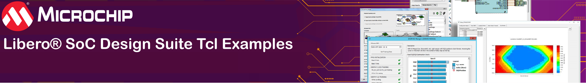

<table style="width:100%">
  <tr>

<th width="100%" colspan="6">
</th>

  </tr>
<tr>
    <td width="17%" align="center" colspan="2"><a href="../main/README.md">Home</a></td>
    <td width="16%" align="center" colspan="2"><a href="../basic_tcl_examples/README.md">Basic Tcl Examples</a></td>
</tr>
</table>

## Welcome to the Libero&reg; SoC Design Suite advanced Tcl examples GitHub Repository! 

This code repository is designed primarily for use with the Libero&reg; SoC Design Suite. Click [here](../../tree/basic_tcl_examples/README.md) if you are looking for basic Tcl command examples.

>**NOTE:** Download and install the latest version of Libero SoC Design Suite from [Libero SoC v12.0 and later](https://www.microsemi.com/product-directory/design-resources/1750-libero-soc#downloads) before working with the examples provided in this repository. For more information on Libero SoC Design Suite installation and licensing setup, see [Libero Software Installation and Licensing Setup Guide](https://www.microsemi.com/document-portal/doc_download/131602-libero-and-software-installation-and-licensing-setup-guide).

The following table describes each Libero SoC Design Suite advanced example in this repository. Click on the hyperlink to go to the example location, where you will see a list of files.

<table style="width:100%">
<tr>
<th width="20%">Tcl Example</th>
<th width="100%">Description</th>
</tr>
<tr>
<td align="center"><a href="../advanced_tcl_examples/HDL_to_programming_flow">HDL to Programming Flow</a></td>
<td >The TCL script in this example creates a new Libero project, imports HDL and constraint files. Runs through complete design flow from synthesis to device programming. Click on the file you are interested in to view the source code.</td>
</tr>
</table>

>**NOTE:** An example is a group or collection of one or more Tcl scripts. The entire repository is managed by a moderator.

&copy;Copyright 2021 Microchip Technology Inc.

